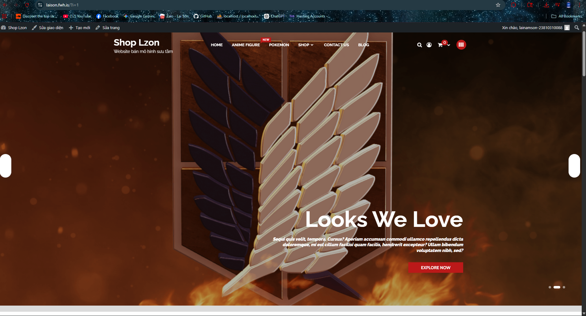
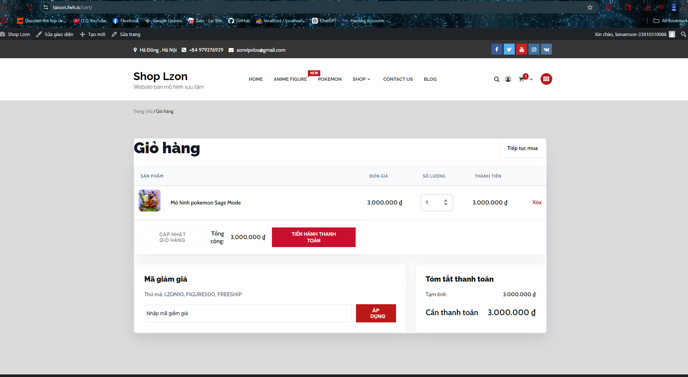
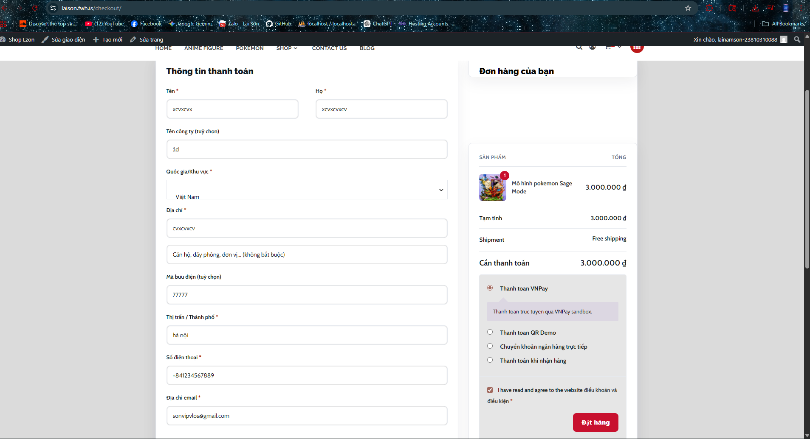

# Shop Lzon - Website ban mo hinh suu tam

## 1. Ten de tai

**Xay dung website ban mo hinh suu tam Shop Lzon bang WordPress va WooCommerce**

## 2. Gioi thieu website/he thong

Shop Lzon la website thuong mai dien tu phuc vu viec ban cac san pham mo hinh suu tam nhu anime figure, Pokemon, One Piece, resin va mini figure.

Website duoc xay dung dua tren nen tang ma nguon mo WordPress, ket hop WooCommerce de quan ly san pham, gio hang, thanh toan va don hang. Ngoai cac chuc nang co san cua WooCommerce, du an co them plugin tu lap trinh rieng de nhap/xuat san pham bang file Excel-compatible, thanh toan VNPay sandbox va QR Demo.

Muc tieu cua he thong:

- Gioi thieu va ban san pham mo hinh suu tam.
- Cho phep khach hang xem san pham, them vao gio hang va dat hang.
- Ho tro dang ky, dang nhap tai khoan khach hang.
- Ho tro quan tri vien quan ly san pham, don hang va du lieu san pham.
- Bo sung chuc nang nhap/xuat file phuc vu quan ly san pham.
- Mo phong quy trinh thanh toan online bang VNPay sandbox va QR Demo.

## 3. Danh sach thanh vien

| STT | Ho va ten | MSSV | Vai tro |
| 1 | Lại Nam sơn | 23810310088 | Nhóm trưởng |
| 2 | Nguyễn thành vinh | 23810310107 | thành viên |
| 3 | Nguyễn Văn Phương | 23810310101 | thành viên |


## 4. Phan cong nhiem vu cu the

| Thanh vien | Nhiem vu |
| --- | --- |
| Lại Nam Sơn | Cai dat WordPress, cau hinh WooCommerce, thiet ke giao dien, tuy bien theme, xay dung plugin Lzon Project Tools, cau hinh VNPay sandbox, QR Demo, nhap/xuat Excel-compatible, deploy hosting, viet bao cao | 
| Nguyễn thành vinh |Chuẩn bị dữ liệu sản phẩm, hỗ trợ tạo danh mục sản phẩm, kiểm tra giao diện người dùng và chụp ảnh minh họa các chức năng chính |
| Nguyễn Văn Phương |Hỗ trợ cấu hình WooCommerce, kiểm tra giỏ hàng, thanh toán, đơn hàng và hỗ trợ hoàn thiện báo cáo, README.|

## 5. Cong nghe su dung

- WordPress
- WooCommerce
- PHP
- MySQL/MariaDB
- HTML, CSS
- Elementor
- Classic Editor
- Theme StoreCommerce
- Child theme Storekeeper
- Plugin tuy bien Lzon Project Tools
- XAMPP
- phpMyAdmin
- Hosting InfinityFree

## 6. Chuc nang chinh cua he thong

### 6.1. Chuc nang nguoi dung

- Xem trang chu website.
- Xem danh sach san pham.
- Xem san pham theo danh muc.
- Xem chi tiet san pham.
- Them san pham vao gio hang.
- Cap nhat so luong san pham trong gio hang.
- Xoa san pham khoi gio hang.
- Dat hang tai trang thanh toan.
- Dang ky tai khoan.
- Dang nhap tai khoan.
- Xem thong tin don hang sau khi dat.

### 6.2. Chuc nang quan tri

- Quan ly san pham WooCommerce.
- Quan ly danh muc san pham.
- Quan ly don hang.
- Quan ly tai khoan nguoi dung.
- Nhap san pham tu file CSV mo duoc bang Excel.
- Xuat danh sach san pham ra file CSV mo duoc bang Excel.
- Cau hinh phuong thuc thanh toan COD, chuyen khoan, VNPay sandbox va QR Demo.

### 6.3. Chuc nang tu lap trinh them

Plugin tu viet:

```text
wp-content/plugins/lzon-project-tools/lzon-project-tools.php
```

Chuc nang plugin:

- Xuat danh sach san pham ra file CSV UTF-8 BOM, mo duoc bang Microsoft Excel.
- Nhap san pham tu file CSV.
- Cap nhat san pham cu neu trung SKU.
- Tao san pham moi neu SKU chua ton tai.
- Tich hop cong thanh toan VNPay sandbox.
- Tao cong thanh toan QR Demo de mo phong thanh toan online.

Cot du lieu file nhap/xuat:

```text
sku,name,regular_price,sale_price,stock_quantity,categories,short_description,description,image_url
```

## 7. Cau truc thu muc quan trong

```text
wp-content/
  themes/
    storekeeper/
      functions.php
      style.css
      page-cart.php
      page-checkout.php
      woocommerce/
        cart/cart.php
        checkout/review-order.php

  plugins/
    lzon-project-tools/
      lzon-project-tools.php
      README.md

  mu-plugins/
    admin-cleanup.php

.htaccess-hosting.txt
README.md
```

## 8. Huong dan cai dat

### 8.1. Yeu cau moi truong

- Cai dat XAMPP.
- Bat Apache va MySQL trong XAMPP.
- Co trinh duyet web.
- Co file source code WordPress cua project.
- Co file database `.sql` cua project.

### 8.2. Cai source code

Copy source code vao thu muc:

```text
C:\xampp\htdocs\LAI_NAM_SON
```

### 8.3. Tao va import database

Mo phpMyAdmin:

```text
http://localhost/phpmyadmin/
```

Tao database:

```text
website_ban_mo_hinh
```

Import file database `.sql` cua project vao database vua tao.

### 8.4. Cau hinh wp-config.php

Kiem tra file:

```text
C:\xampp\htdocs\LAI_NAM_SON\wp-config.php
```

Cau hinh database local:

```php
define('DB_NAME', 'website_ban_mo_hinh');
define('DB_USER', 'root');
define('DB_PASSWORD', '');
define('DB_HOST', 'localhost');
```

### 8.5. Cau hinh duong dan local

Neu import database tu may khac, chay SQL:

```sql
UPDATE wp_options
SET option_value = 'http://localhost/LAI_NAM_SON'
WHERE option_name IN ('siteurl', 'home');
```

## 9. Huong dan chay project

### 9.1. Chay tren localhost

1. Mo XAMPP.
2. Bat Apache.
3. Bat MySQL.
4. Mo website:

```text
http://localhost/LAI_NAM_SON/
```

5. Mo trang quan tri:

```text
http://localhost/LAI_NAM_SON/wp-admin/
```

### 9.2. Cac plugin can kich hoat

Trong WordPress Admin, vao:

```text
Plugins > Installed Plugins
```

Kich hoat cac plugin:

- WooCommerce
- Elementor
- Classic Editor
- Lzon Project Tools

### 9.3. Cau hinh trang WooCommerce

Neu trang gio hang, thanh toan hoac tai khoan hien sai noi dung, chay SQL:

```sql
UPDATE wp_posts
SET post_content = '[woocommerce_cart]',
    post_title = 'Gio hang'
WHERE post_name IN ('cart', 'gio-hang')
  AND post_type = 'page';

UPDATE wp_posts
SET post_content = '[woocommerce_checkout]',
    post_title = 'Thanh toan'
WHERE post_name IN ('checkout', 'thanh-toan')
  AND post_type = 'page';

UPDATE wp_posts
SET post_content = '[woocommerce_my_account]',
    post_title = 'Tai khoan'
WHERE post_name IN ('my-account', 'tai-khoan')
  AND post_type = 'page';
```

### 9.4. Tat che do Coming Soon cua WooCommerce

Neu website hien thong bao "Nhung dieu tuyet voi dang o phia truoc", chay SQL:

```sql
UPDATE wp_options
SET option_value = 'no'
WHERE option_name IN (
  'woocommerce_coming_soon',
  'woocommerce_feature_site_visibility_badge_enabled'
);
```

### 9.5. Bat dang ky tai khoan va hien o mat khau

```sql
UPDATE wp_options SET option_value = '1'
WHERE option_name = 'users_can_register';

UPDATE wp_options SET option_value = 'yes'
WHERE option_name = 'woocommerce_enable_myaccount_registration';

UPDATE wp_options SET option_value = 'no'
WHERE option_name = 'woocommerce_registration_generate_password';

UPDATE wp_options SET option_value = 'yes'
WHERE option_name = 'woocommerce_registration_generate_username';
```

## 10. Huong dan su dung chuc nang chinh

### 10.1. Them san pham vao gio hang

1. Vao trang cua hang hoac trang danh muc san pham.
2. Chon san pham.
3. Bam them vao gio hang.
4. Vao trang gio hang de kiem tra san pham.

### 10.2. Dat hang

1. Vao gio hang.
2. Bam tien hanh thanh toan.
3. Nhap thong tin thanh toan.
4. Chon phuong thuc thanh toan.
5. Bam dat hang.

### 10.3. Nhap/xuat Excel-compatible

Duong dan:

```text
WooCommerce > Lzon Excel
```

Chuc nang:

- Bam Download Excel CSV de xuat san pham.
- Chon file CSV va bam Import products de nhap san pham.

### 10.4. Thanh toan VNPay sandbox

Duong dan cau hinh:

```text
WooCommerce > Settings > Payments > VNPay Sandbox
```

Can dien:

- `vnp_TmnCode`
- `vnp_HashSecret`
- `Payment URL`: `https://sandbox.vnpayment.vn/paymentv2/vpcpay.html`

### 10.5. Thanh toan QR Demo

Duong dan cau hinh:

```text
WooCommerce > Settings > Payments > QR Demo
```

QR Demo chi dung de mo phong thanh toan, khong tru tien that.

## 11. Tai khoan demo

### 11.1. Tai khoan quan tri

```text
URL admin: http://localhost/LAI_NAM_SON/wp-admin/
Username: dien_tai_khoan_admin
Password: dien_mat_khau_admin
```

### 11.2. Tai khoan khach hang

```text
URL tai khoan: http://localhost/LAI_NAM_SON/my-account/
Username/Email: dien_email_khach_hang
Password: dien_mat_khau_khach_hang
```

> Luu y: Khong nen day mat khau that len GitHub public. Neu nop bai qua file nen co the dien tai khoan demo rieng.

## 12. Hinh anh minh hoa he thong

Co the dat anh chup man hinh vao thu muc:

```text
docs/images/
```

Danh sach anh nen co:

| STT | Man hinh | File minh hoa |
| --- | --- | --- |
| 1 | Trang chu | `docs/images/trang-chu.png` |
| 2 | Danh sach san pham | `docs/images/san-pham.png` |
| 3 | Chi tiet san pham | `docs/images/chi-tiet-san-pham.png` |
| 4 | Gio hang | `docs/images/gio-hang.png` |
| 5 | Thanh toan | `docs/images/thanh-toan.png` |
| 6 | Dang nhap / dang ky | `docs/images/tai-khoan.png` |
| 7 | Lzon Excel import/export | `docs/images/lzon-excel.png` |
| 8 | VNPay sandbox | `docs/images/vnpay-sandbox.png` |
| 9 | QR Demo | `docs/images/qr-demo.png` |

Chen anh minh hoa trong README theo mau:

```md



```

## 13. Link video demo

```text
Dien link video demo tai day
```

Vi du:

```text
https://youtu.be/your-video-demo
```

## 14. Link online da deploy

Website da deploy:

```text
http://laison.fwh.is/
```

Trang quan tri hosting:

```text
http://laison.fwh.is/wp-admin/
```

## 15. Huong dan deploy hosting

### 15.1. Upload source

Upload source WordPress len thu muc goc hosting:

```text
htdocs/
```

Khong upload thua mot lop thu muc. Cau truc dung:

```text
htdocs/wp-admin
htdocs/wp-content
htdocs/wp-includes
```

### 15.2. Upload plugin tu viet

Dam bao hosting co file:

```text
htdocs/wp-content/plugins/lzon-project-tools/lzon-project-tools.php
```

Sau do vao WordPress Admin tren hosting va kich hoat plugin:

```text
Plugins > Lzon Project Tools > Activate
```

### 15.3. Cau hinh .htaccess hosting

Dung noi dung trong file:

```text
.htaccess-hosting.txt
```

Noi dung:

```apache
# BEGIN WordPress
<IfModule mod_rewrite.c>
RewriteEngine On
RewriteRule .* - [E=HTTP_AUTHORIZATION:%{HTTP:Authorization}]
RewriteBase /
RewriteRule ^index\.php$ - [L]
RewriteCond %{REQUEST_FILENAME} !-f
RewriteCond %{REQUEST_FILENAME} !-d
RewriteRule . /index.php [L]
</IfModule>
# END WordPress
```

### 15.4. Cau hinh URL hosting

Trong phpMyAdmin hosting, chay:

```sql
UPDATE wp_options
SET option_value = 'http://laison.fwh.is'
WHERE option_name IN ('siteurl', 'home');
```

## 16. Cac muc dap ung de cuong

| Yeu cau trong de cuong | Trang thai |
| --- | --- |
| Cai dat va chay duoc ma nguon mo | Da dap ung |
| Cau hinh website ban hang | Da dap ung |
| Tuy bien giao dien/skin | Da dap ung |
| Lap trinh chuc nang moi | Da dap ung |
| Nhap/xuat file Excel | Da dap ung bang CSV mo duoc trong Excel |
| Thanh toan online | Da dap ung o muc VNPay sandbox va QR Demo |
| Dua len hosting that | Da dap ung neu website chay on dinh tren InfinityFree |
| Bao cao do an | Da co, can cap nhat them anh va mo ta chuc nang moi |

## 17. Ghi chu khi nop bai

Nen nop kem:

- Source code WordPress.
- File database `.sql`.
- File bao cao.
- File README.md.
- Anh chup cac chuc nang chinh.
- Link video demo.
- Link website online da deploy.

Khong dua cac thong tin bao mat len public:

- Mat khau admin that.
- Mat khau database hosting.
- `vnp_HashSecret` that.
- Tai khoan hosting.

